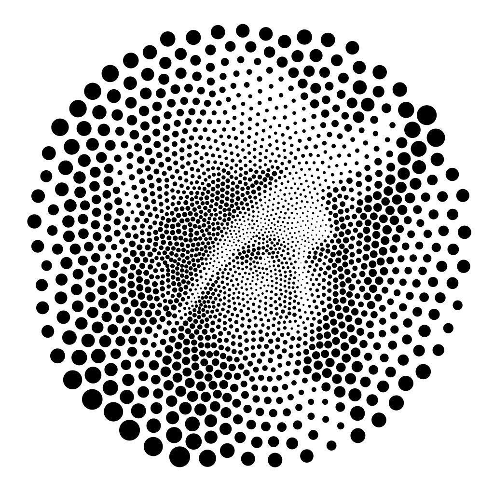

# IQ Net

For data with many similar features exist single function which can capture large amount of learned features.

 
*Image made of patterns*
 

## Goal of NN
Input data is first separated into N-length input vector. This vector stores representation for single given input symbol.

With given set of inputs find function which is able to represent each feature as independent scalar in output space.

## Useful references
- Geometric deep learning: https://arxiv.org/abs/2104.13478
- Transformer network: https://arxiv.org/abs/1911.06455
- Single head is better: https://arxiv.org/abs/2106.09650

## Video lectures
- What do neural networks learn: https://youtu.be/FSfN2K3tnJU
 
This holds for only dense layers. In most cases layer normalization fix this behavior.

## Random thoughts

Width of network is used for specifying resolution of given function.
This can be imagined like n-order polynomial.

Depth of network is used to merge and refine facts found in lower layers into higher representation of concept like features.

Width and depth are performing 2 very different operation, with is completely depended in all aspects (weights are distinct). For depth is important weight sharing (voting like structure), simplest way is to think in graph like structure.

Typical implementation is transformer like structure which are graph-like lookup table, with attention. Attention is voting like system, where some values are more probable then others.

Routing is completely learned from data with gradient decent (SGD). Thus network has learn distribution of training data. This is not ideal because model have probably found hacks to find correct solution but cannot generalize in real world.

To fix this limitation model has to learn model of given world, and then try to perform planning (making prediction) about environment (this can be seen as find best compression function).

Main problem of real world problems is complexity which cannot be simulated in lossless mode.

Solution is to model over idealistic world, with only few variables. Then complexity is greatly reduced.

Planning and testing will improve model accuracy and generalization. My thinking is try to make, fail, repeat,.. Over time planing will increase.

### Complexity estimation

Small models are hard to train. GPU required.
